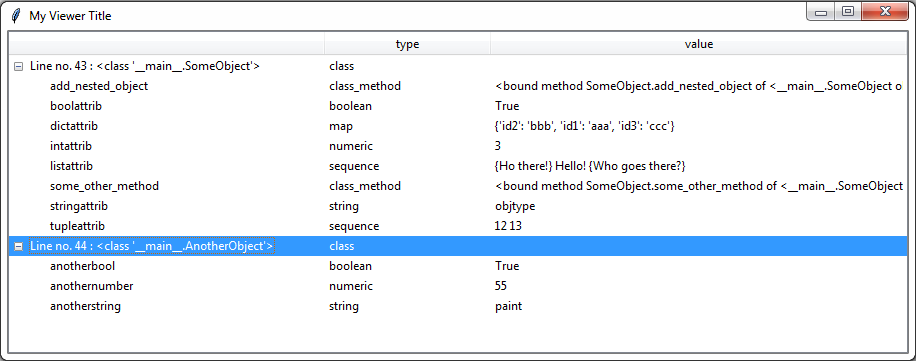
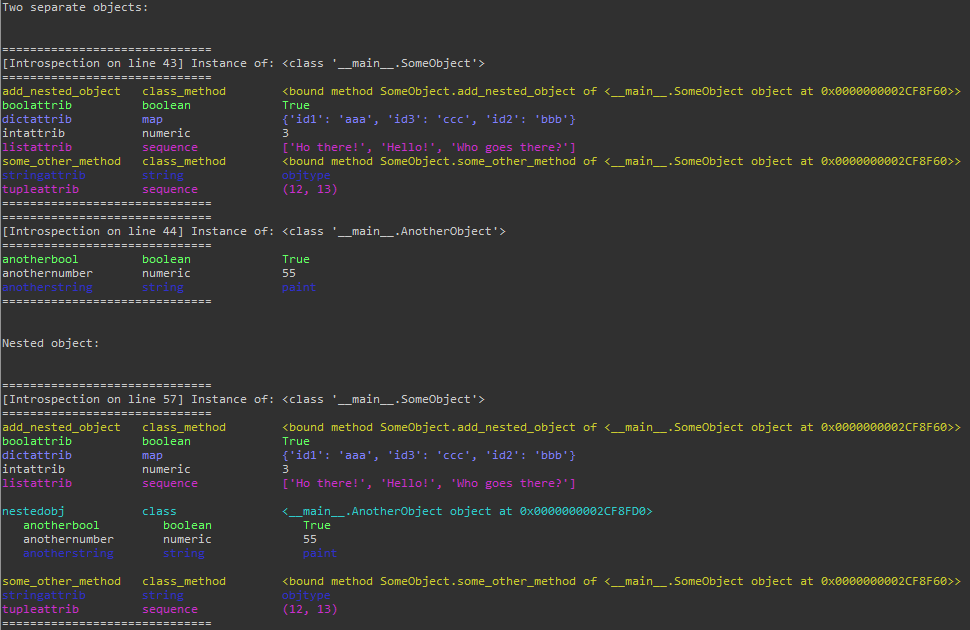
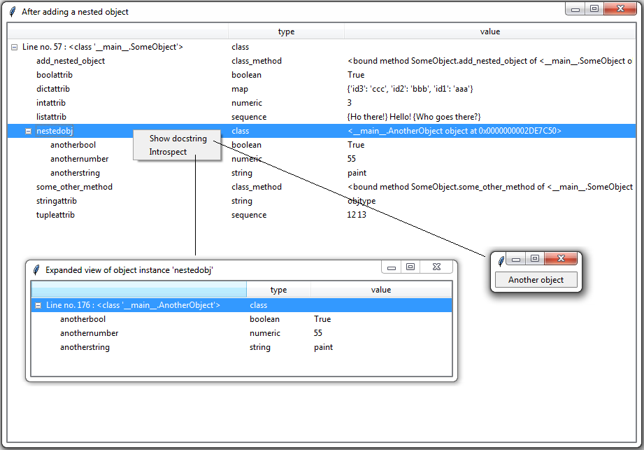

# INTROSPECTION

An introspection tool which can be used to browse see inside your python code objects.

To pip install:

```
pip install git+https://git@bitbucket.org/aleks_krnjaic/intra.git
```

## OPTION 1 - Quick Inspection 

Does not provide the ability to customize which objects appear in the viewer. See picture in next section for an example of the UI.

```python
from intra import quick_inspect
quick_inspect(object)
```


## OPTION 2 - Configure Inspection

Expanded way of introspecting and placing objects in the viewer. Provides more configurability.

```python
from intra import introspect, IntraUI

# have some objects you want to analyze
my_obj = SomeObject()
another_obj = AnotherObject()


# perform the introspection. This gives you an IntrospectionResult which you can then view via command line or UI. This example will show you how its used in a UI.
inspection1 = introspect(my_obj)
inspection2 = introspect(another_obj)

# create the UI container.
ui = IntraUI()

# View the inspections using the UI. You can add multiple inspections to the same viewer. You can also create multiple viewers.
viewer = ui.createViewer("My Viewer Title")
viewer.add(inspection1)
viewer.add(inspection2)
```



## OPTION 3 - Command line only

For when you're only able to use the command line. Attempts to create a treeview with colors for each element type.

```python
from intra import introspect, iprint

inspection1 = introspect(my_obj)
iprint(inspection1)
```


## ADDITIONAL


### Recursion
You have the ability to ask the introspection tool to recurse through objects. This will only work if you do not have circular references, otherwise an error will be thrown.

This can be done by providing a recurse option to the introspect method:

inspection = introspect(my_obj, recurse=True)


### Context Menus - Further introspection & docstrings

You can right click the entries to further introspect nested objects. They will appear in a new window. You can also view the docstring of the attribute.

